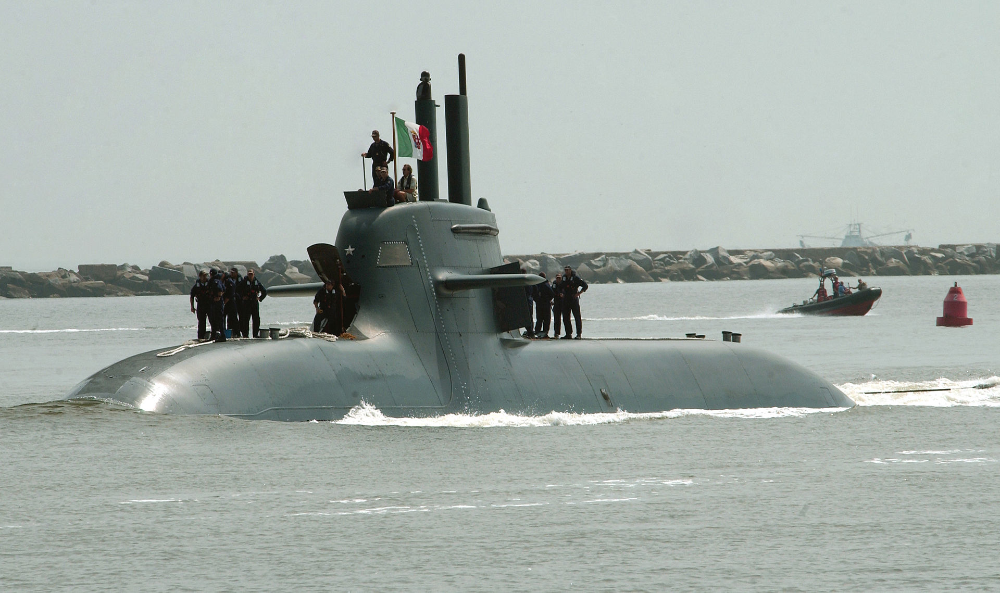

# U212 Drools
Core of the Kafka HA

https://en.wikipedia.org/wiki/Type_212_submarine

## Installing and Running
- Kafka Cluster on Openshift
https://github.com/desmax74/openshift-handbook/blob/master/fedora/kafka.md

- Prerequisites: install qs-playground 8.0-SNAPSHOT
